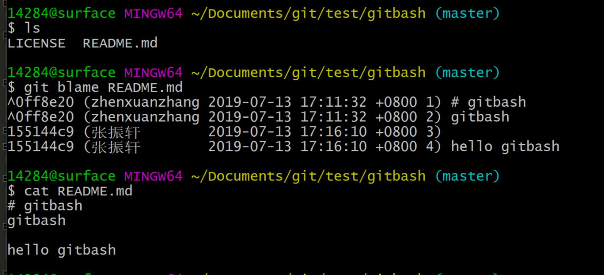
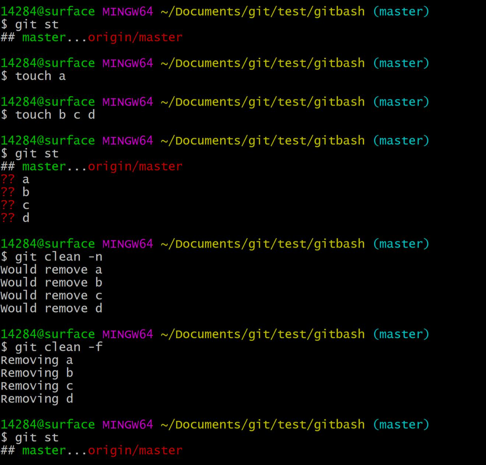
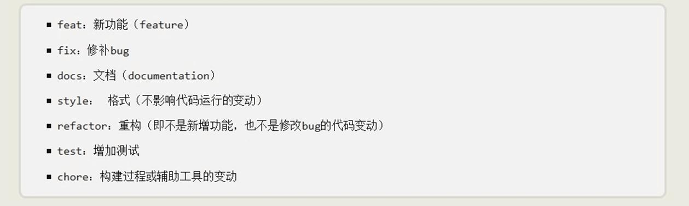
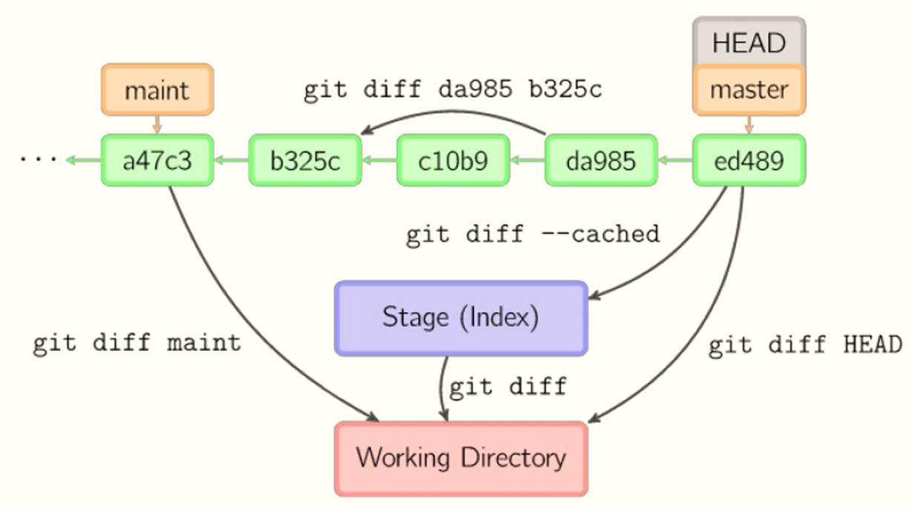
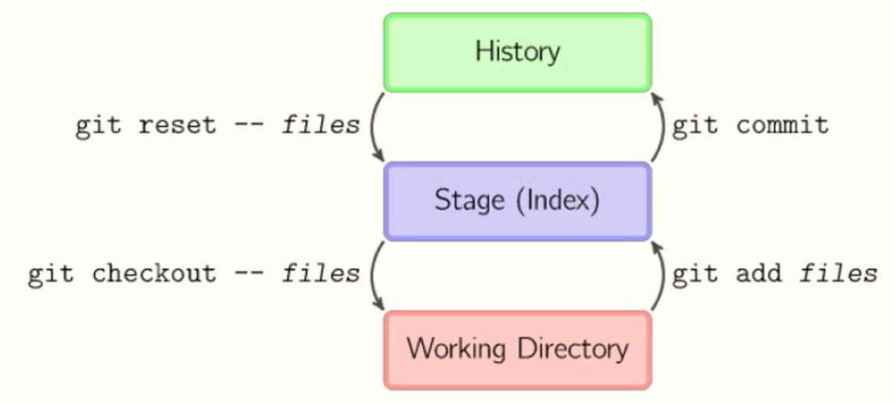

# git配置

---
# 目录
* [gitignore](#gitignore)
* [换行符](#换行符)
* [别名](#别名)
* [凭证](#凭证)
* [git基本操作](#git基本操作)
	* [git](#git)
	* [git blame](#gitblame)
	* [git clean](#gitclean)
	* [git add](#gitadd)
	* [git commit](#gitcommit)
	* [回撤](#回撤)
---

## gitignore
* [目录](#目录)

	使用场合：
	忽略操作系统自动生成的文件，比如：缩略图，等；
	忽略编译生成的中间文件、可执行文件等，比如： C 语言编译产生的 .obj 文件和 .exe 文件；
	忽略你自己的带有敏感信息的配置文件，比如：存放口令的配置文件；
	tmp/ 临时目录；
	log/ 日志目录
 

     
- vim .gitignore #编辑gitignore文件，加入要忽略的文件  
- git add -f file #强制添加被忽略的文件
- git check-ignore -v file #查看file在.gitignore中的位置

- [我的testignore库](https://github.com/zhenxuanzhang/testignore)
- [github官方gitignore库](https://github.com/github/gitignore)

## 换行符

	# CR: carriage return 回车，光标到首行， ‘\r’ = return
	# LF: line feed 换行，光标下移一行，’\n’ = newline
	# linux: 换行 \n
	# windows: 换行 \r\n
	# MAC OS: 换行 \r

	# 提交时转换为LF，检出时转换为CRLF，默认设置不用修改，Git 是 linux 配置
	git config –-global core.autocrlf true
	# 允许提交包含混合换行符的文件
	git config –-global core.safecrlf false

## 别名

	# 以图形的方式打印 Git 提交日志
	git log –pretty=format:’%h %ad | %s%d’ –graph –date=short
	# 设置别名
	git config –-global alias.ci commit

	
## 凭证  

	# 存储凭证
	git config –-global credential.helper wincred

## git基本操作
* [目录](#目录)

### git  
	# git 常用命令信息
	git

	# 查看全部 git 子命令
	git help -a

### gitblame

	# 逐行查看文件的修改历史
	git blame <file name>

	# 从第 100 行开始，到 110 行。逐行查看文件的修改历史
	git blame –L 100,110 <file name>

### gitclean

	# 列出打算清除的档案
	git clean -n

	# 真正的删除
	git clean –f

	# 连 .gitignore 中忽略的档案也清除
	git clean -x

### gitadd  
* [目录](#目录)    

	# 添加新文件
	git add a
	# 删除文件
	rm a
	git add a
	等价于下面一行
	git rm 
---	
	# 编辑文件（增加内容、删除内容、修改内容）
	vi a
	# 文件改名
	git mv a b  
	a改名为b
	# 文件移动
	git mv a ./demos/
---
	# 文件夹的操作（添加、删除、改名、移动）
	mkdir demo
	git st
	cd demo
	touch b
	git st
	git add .
	git st
---
	# 一个文件多个提交
	原文件已被提交
	然后对一个文件作多处修改，不用git add a
	git add –p a
	询问[y,n,q,a,d,s,e,?]?
	y暂存，n不暂存，q退出,s分割,e手工编辑块
	s
	选择分块y/n
	
	git diff 
	git diff --cached
	git ci -m 'update ..'
	
	git add -p a
	...
	
	git show HEAD
	git show HEAD^
	
	
### gitcommit  
* [目录](#目录)    

	# add & commit mothed 1
	git add . 
	git commit –m “message”
	# add & commit mothed 2
	git commit –a –m “message”

	# add & commit mothed 3
	git commit –am “message”

---
	每个提交要保证适当的颗粒度、相关性和独立性。
	- 以一个小功能、小改进或一个 bug fix 为单位  
	- 对应的 unit test 程序在同一个 commit  
	- 无相关的修改不在同一个 commit  
	- 语法错误的半成品程序不能 commit 

---

---
[git commit文档规范](http://www.ruanyifeng.com/blog/2016/01/commit_message_change_log.html)

### 信息查看
* [目录](#目录)   

	# short and branch
	git status -sb

	# 查看某个提交信息
	git show HEAD
	git shou harshvalue # 查看哈希值对应的提交

- git show HEAD^^ #查看上一个提交的信息
- git show HEAD^^ #查看前面第二个提交
- git show HEAD~2 #查看前面第3个提交
---

	# 查看提交历史  
	git log <file name>  
	git log --grep <msg>  
	git log -n  

- 只想看某一类记录
- git log --grep <msg>
- 只看前几次记录
- git log -n

### gitdiff

  

	cat a
	111
	222
	333
	444
	555
	666
	777
	
	7次修改，每次向下增加一行，第六次修改在暂存区，
	第七次修改在工作目录，前5次修改已经提交了。
- git diff 工作目录与暂存区的差异，以暂存区为基准  
	+777
- git diff -cached 暂存区与最后一次提交版本的差异  
	+666
- git diff HEAD 工作目录与最后一次提交版本的差异  
	+666  
	+777
- git diff hash2 hash4 第四个版本与第二个版本的差异，以第二个版本为基准  
	+333  
	+444
- 或者用HEAD定位
- git diff HEAD~3 HEAD~1 第四个版本与第二个版本的差异，以第二个版本为基准  
	+333   
	+444
- git tag maint HEAD~4 给第一次提交打上标签
- git diff maint 查看工作目录与第一次提交的差异
- git diff -cached maint 暂存区与第一次提交版本的差异

## 回撤
* [目录](#目录)

	# 回撤暂存区内容到工作目录
	git reset HEAD

	# 回撤提交到暂存区
	git reset HEAD --soft

	# 回撤提交，放弃变更
	git reset HEAD –-hard

	# 回撤远程仓库，-f  即 --force
	git push -f
	!慎用此行
	
- 
